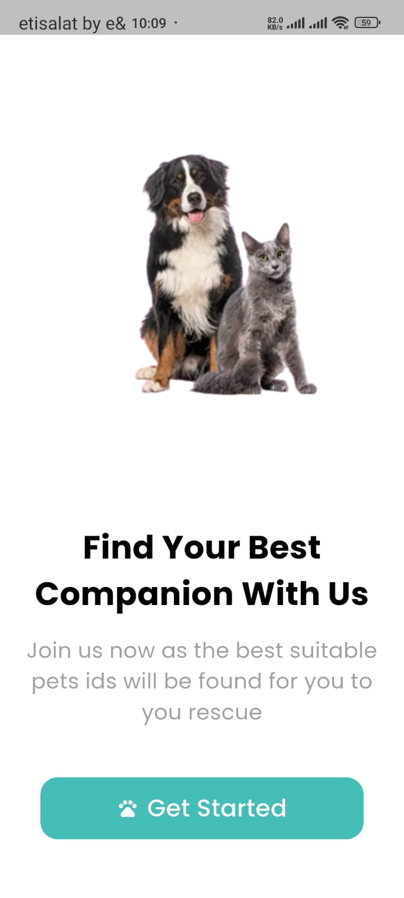
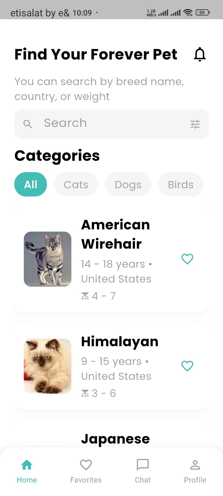
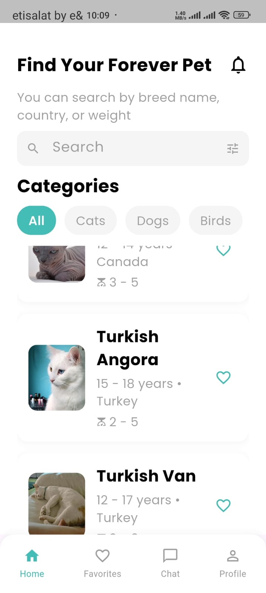
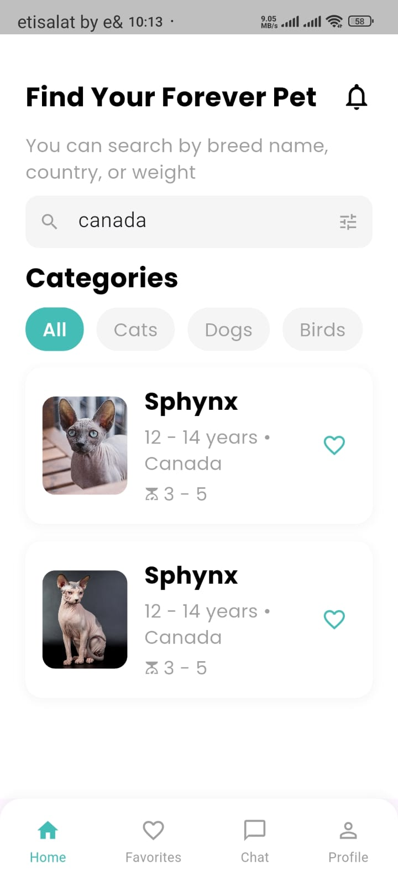
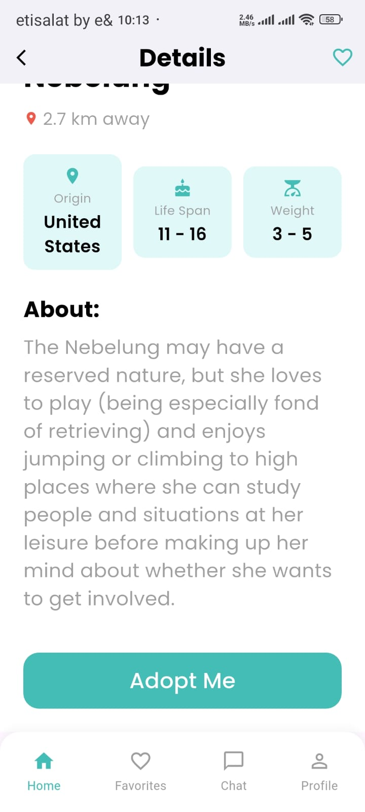
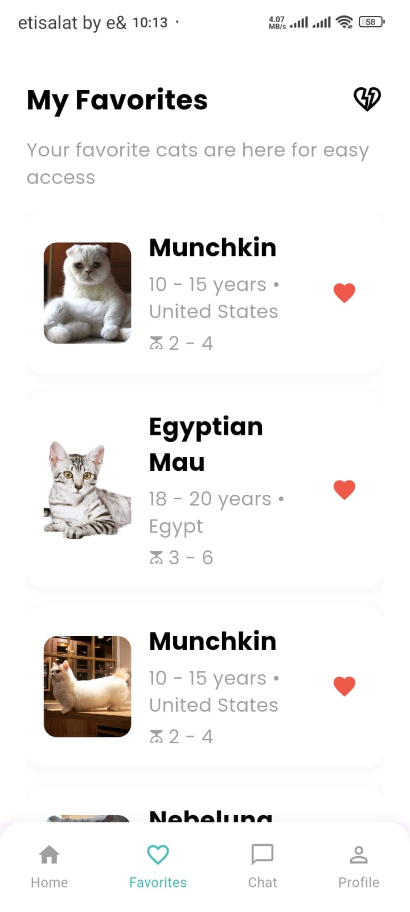

# PetFinder App
[](https://deepwiki.com/Badr-Elarby/Badr-Elarby-Week-4-PetFinder_app)

PetFinder App is a mobile application built with Flutter that allows users to discover, view details, and save their favorite cats. It leverages [The Cat API](https://thecatapi.com/) to provide an extensive and randomly generated list of cat profiles, showcasing a modern and scalable app architecture.


* * * * * * * * * * * * * * * * * * * * * * * * * * * * * * * * * * * * * * * * * * * * * * * * * * * * * * * * * * * * * * *
**For a deeper understanding of the project — including detailed diagrams and an in-depth breakdown of each layer and feature —** 
**[click here](https://deepwiki.com/Badr-Elarby/Badr-Elarby-Week-4-PetFinder_app)**.
* * * * * * * * * * * * * * * * * * * * * * * * * * * * * * * * * * * * * * * * * * * * * * * * * * * * * * * * * * * * * * *


## Features

-   **Infinite Scrolling:** Discover new cats with an endlessly scrollable home feed.
-   **Detailed Profiles:** Tap any cat to view detailed information, including its breed, origin, life span, weight, and temperament.
-   **Persistent Favorites:** Save your favorite cats for later. Your favorites list is stored locally on your device.
-   **Dynamic Search:** Find specific cats by searching for breed name, origin, or weight.
-   **Responsive UI:** The user interface is built with `flutter_screenutil` to adapt gracefully to different screen sizes.

## Architecture & Tech Stack

This project is built using a **Clean Architecture** approach, promoting a clear separation of concerns, scalability, and testability. The code is organized into feature-based modules.

-   **Framework:** Flutter & Dart
-   **Architecture:** Clean Architecture with a feature-led project structure.
-   **State Management:** BLoC (Cubit) for predictable and efficient state management.
-   **Dependency Injection:** GetIt for managing dependencies and providing services.
-   **Navigation:** GoRouter for declarative routing, including shell routes for the bottom navigation bar.
-   **Networking:** Dio for API requests, featuring a custom interceptor for API key management and logging.
-   **Local Storage:** SharedPreferences for persisting the user's favorite cats.
-   **Testing:** Unit and Widget tests for Cubits, repositories, and UI components using `bloc_test` and `mocktail`.

## Project Structure

The project's `lib` directory is organized by features, with a `core` directory for shared functionality.

```
lib/
├── core/                  # Shared utilities, services, and widgets
│   ├── di/                # Dependency injection setup (get_it)
│   ├── network/           # Dio configuration and interceptors
│   ├── routing/           # App routing with GoRouter
│   ├── services/          # Core services (e.g., local storage)
│   ├── utils/             # App-wide constants (colors, styles)
│   └── widgets/           # Common widgets (e.g., BottomNavBar)
├── features/              # Individual feature modules
│   ├── auth/              # Authentication (login, signup)
│   ├── Cart/              # Shopping cart functionality
│   ├── Favorites/         # Wishlist/favorites management
│   ├── home/              # Home screen and product listing
│   ├── onboarding/        # Initial setup screens (gender selection)
│   ├── ProductDetails/    # Product details screen
│   └── spalsh/            # Splash screen
└── main.dart              # Application entry point
```

## Getting Started

Follow these instructions to get a copy of the project up and running on your local machine for development and testing.

### Prerequisites

-   Flutter SDK (version 3.8.1 or higher)
-   An editor like VS Code or Android Studio with the Flutter plugin.

### Installation

1.  **Clone the repository:**
    ```sh
    git clone https://github.com/badr-elarby/badr-elarby-week-4-petfinder_app.git
    cd badr-elarby-week-4-petfinder_app
    ```

2.  **Install dependencies:**
    ```sh
    flutter pub get
    ```

3.  **Run the application:**
    ```sh
    flutter run


    
* * * * * * * * * * * * * * * * * * * * * * * * * * * * * * * * * * * * * * * * * * * * * * * * * * * * * * * * * * * * * * *
## 📸 Screenshots

### 🟢 Splash & Onboarding
| Splash | Onboarding |
|:--:|:--:|
|  |  |

---

### 🏠 Home Screens
| Home 1 | Home 2 | Home 3 |
|:--:|:--:|:--:|
|  |  |  |

---

### 🐾 Category Details & Favorites
| Category Details | Favorites |
|:--:|:--:|
|  |  |

* * * * * * * * * * * * * * * * * * * * * * * * * * * * * * * * * * * * * * * * * * * * * * * * * * * * * * * * * * * * * * *

## 🎬 App Demo


